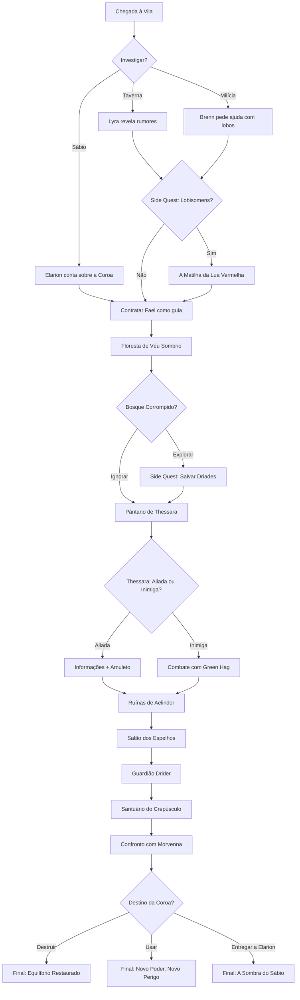

# 🏰 A Coroa do Crepúsculo
## Índice da Campanha

> **Sistema:** D&D 5ª Edição | **Jogadores:** 4 | **Nível:** 6 | **Duração:** ~8 horas
> **Tema:** Dark Fantasy / Feywild / Intriga

---

## 📖 Estrutura da Campanha

### Visão Geral
- [[01 - Visão Geral|Sinopse, Gancho e Arco Narrativo]]

### Ato 1 — A Vila de Raízes Profundas *(~2h)*
> *Os heróis chegam à vila e descobrem que algo sinistro se esconde sob a aparente tranquilidade.*

- [[Cena 1.1 - Chegada à Vila|1.1 — Chegada à Vila]]
- [[Cena 1.2 - Investigação e Pistas|1.2 — Investigação e Pistas]]
- [[Cena 1.3 - A Matilha da Lua Vermelha|1.3 — Quest: A Matilha da Lua Vermelha]] *(Side Quest)*

### Ato 2 — A Floresta de Véu Sombrio *(~2.5h)*
> *A jornada pela floresta amaldiçoada revela perigos antigos e aliados inesperados.*

- [[Cena 2.1 - Adentrando a Floresta|2.1 — Adentrando a Floresta]]
- [[Cena 2.2 - O Bosque Corrompido|2.2 — Quest: O Bosque Corrompido]] *(Side Quest)*
- [[Cena 2.3 - A Bruxa do Pântano|2.3 — A Bruxa do Pântano]]

### Ato 3 — As Ruínas de Aelindor *(~2h)*
> *As ruínas élficas guardam armadilhas ancestrais e servos da escuridão.*

- [[Cena 3.1 - A Entrada das Ruínas|3.1 — A Entrada das Ruínas]]
- [[Cena 3.2 - O Salão dos Espelhos|3.2 — O Salão dos Espelhos]]
- [[Cena 3.3 - O Guardião Drider|3.3 — O Guardião Drider]]

### Ato 4 — O Santuário do Crepúsculo *(~1.5h)*
> *O confronto final contra Morvenna e o destino da Coroa.*

- [[Cena 4.1 - A Câmara da Coroa|4.1 — A Câmara da Coroa]]
- [[Cena 4.2 - Confronto Final|4.2 — Confronto Final]]
- [[Cena 4.3 - Desfechos|4.3 — Desfechos]]

---

## 🎲 Encontros Aleatórios
- [[Tabela - Estrada|Estrada para Raízes Profundas]]
- [[Tabela - Floresta|Floresta de Véu Sombrio]]
- [[Tabela - Ruínas|Ruínas de Aelindor]]

---

## 👤 PdMs (Personagens do Mestre)
| PdM | Papel | Localização |
|-----|-------|-------------|
| [[Elarion - O Sábio Élfico]] | Quest Giver / Mentor | Vila / Ruínas |
| [[Thessara - A Bruxa Verde]] | Aliada Ambígua | Floresta |
| [[Morvenna - A Bruxa Noturna]] | Vilã Principal | Santuário |
| [[Capitão Brenn]] | Líder da Milícia | Vila |
| [[Lyra - A Estalajadeira]] | Informante | Vila |
| [[Fael - O Guia]] | Guia / Possível Traidor | Floresta / Ruínas |

---

## 👹 Monstros
- [[Ficha - Night Hag|Night Hag (Morvenna)]]
- [[Ficha - Green Hag|Green Hag (Thessara)]]
- [[Ficha - Drider|Drider (Guardião)]]
- [[Ficha - Owlbear|Owlbear]]
- [[Ficha - Phase Spider|Phase Spider]]
- [[Ficha - Werewolf|Werewolf]]
- [[Ficha - Gargoyle|Gargoyle]]
- [[Ficha - Ghost|Ghost]]
- [[Ficha - Doppelganger|Doppelganger]]
- [[Ficha - Animated Armor|Animated Armor]]
- [[Ficha - Cult Fanatic|Cult Fanatic]]
- [[Ficha - Ghoul|Ghoul]]

---

## ⚔️ Itens Mágicos
- [[A Coroa do Crepúsculo]] *(Artefato Central)*
- [[Lâmina Lunar]]
- [[Heartstone de Morvenna]]
- [[Amuleto da Dríade]]

---

## 🗺️ Mapa Narrativo (Grafo de Decisões)

