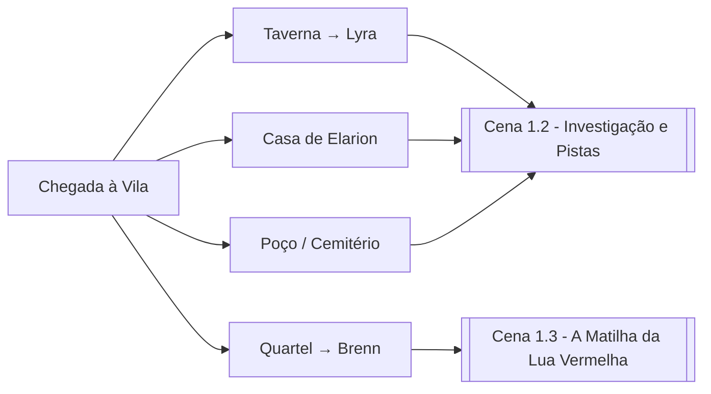

# 🏘️ Cena 1.1 — Chegada à Vila de Raízes Profundas

> **Duração estimada:** 30-45 min | **Tom:** Mistério, desconfiança
> **Trilha sonora sugerida:** Ambiente de vila medieval com vento distante

---

## Leitura Dramática (Box Text)

> *A estrada de terra se afunila entre campos de trigo ressequido até revelar Raízes Profundas — uma vila de talvez duzentas almas, construída onde as raízes colossais de uma árvore morta emergem do solo como os dedos de um gigante enterrado. As casas de madeira e pedra se amontoam ao redor de uma praça central, onde um poço coberto de musgo marca o coração da comunidade.*
>
> *Há algo errado. São apenas meados da tarde, mas as ruas estão quase desertas. As janelas dos chalés estão fechadas com venezianas, e uma mulher arrasta uma criança pela mão com urgência, lançando um olhar receoso na direção de vocês antes de desaparecer numa viela.*
>
> *O único sinal de vida é a luz amarelada que escapa da taverna "A Raiz Torta", de onde vem o murmúrio abafado de vozes.*

---

## Locais de Interesse

### A Raiz Torta (Taverna)
- Dirigida por **[[Lyra - A Estalajadeira|Lyra]]**, uma halfling perspicaz
- 4-6 moradores bebendo em silêncio tenso
- Preços normais, quartos disponíveis (5 pp/noite)
- **Informações disponíveis:** ver [[Cena 1.2 - Investigação e Pistas|Cena 1.2]]

### Quartel da Milícia
- **[[Capitão Brenn]]** comanda 8 milicianos
- Claramente sobrecarregados — olheiras, armaduras mal cuidadas
- Brenn busca ajuda com os lobos que atacam o gado → gancho para [[Cena 1.3 - A Matilha da Lua Vermelha|Side Quest]]

### Casa de Elarion
- Pequena torre de pedra na borda da vila, coberta de hera
- **[[Elarion - O Sábio Élfico|Elarion]]** recebe os jogadores com chá e urgência
- Tem um mapa antigo das ruínas de Aelindor (parcial)
- Sugere contratar **[[Fael - O Guia|Fael]]** como guia pela floresta

### O Poço Central
- **Teste de Percepção DC 14:** Marcas de garras nos musgos ao redor
- **Teste de Arcana DC 16:** Fraca emanação de magia de necromancia na água
- Se os jogadores investigarem à noite → possível encontro com [[Ficha - Ghoul|2 Ghouls]] que emergem (ver Encontro Opcional abaixo)

### Cemitério da Vila
- Nos fundos da vila, parcialmente invadido pelas raízes da árvore morta
- **3 túmulos recentemente violados** (obra dos ghouls)
- **Teste de Religião DC 13:** Os símbolos protetores nos túmulos foram deliberadamente raspados
- **Teste de Investigação DC 15:** Encontram um **símbolo de Lolth** gravado numa raiz próxima → pista do culto

---

## Encontro Opcional: Ghouls no Poço

> **Trigger:** Os jogadores investigam o poço à noite ou ficam vigiando a praça.

| Criatura | Qtd | CR | HP | AC | XP |
|----------|-----|----|----|----|----|
| [[Ficha - Ghoul\|Ghoul]] | 2 | 1 | 22 | 12 | 200 cada |

**Dificuldade:** Fácil (400 XP vs threshold de 600 para 4 PJs nível 6)

**Tática:** Os ghouls emergem do poço (que se conecta a túneis subterrâneos). Atacam o alvo mais próximo. Fogem se reduzidos a 5 HP ou menos.

**Pista:** Um dos ghouls porta um medalhão com o símbolo de uma aranha — ligação com o culto de Morvenna.

---

## Caminhos Possíveis

---

## Notas para o Mestre

- **Tom:** A vila está com medo. Os moradores desconfiam de estranhos mas estão desesperados. Recompense jogadores que abordam com empatia.
- **Tempo:** Considere que chegam no meio da tarde. Dê 2-3 horas de "tempo in-game" antes do anoitecer para explorarem.
- **Pesadelos:** Se os jogadores descansarem na vila, aplique a regra de [[01 - Visão Geral#Pesadelos de Morvenna|Pesadelos de Morvenna]].
- **[[Fael - O Guia|Fael]]** pode ser encontrado na taverna se os jogadores perguntarem. Ele se oferece como guia por 50 po.

---

**Próximo:** [[Cena 1.2 - Investigação e Pistas|Cena 1.2 — Investigação e Pistas →]]
**Side Quest:** [[Cena 1.3 - A Matilha da Lua Vermelha|A Matilha da Lua Vermelha →]]
