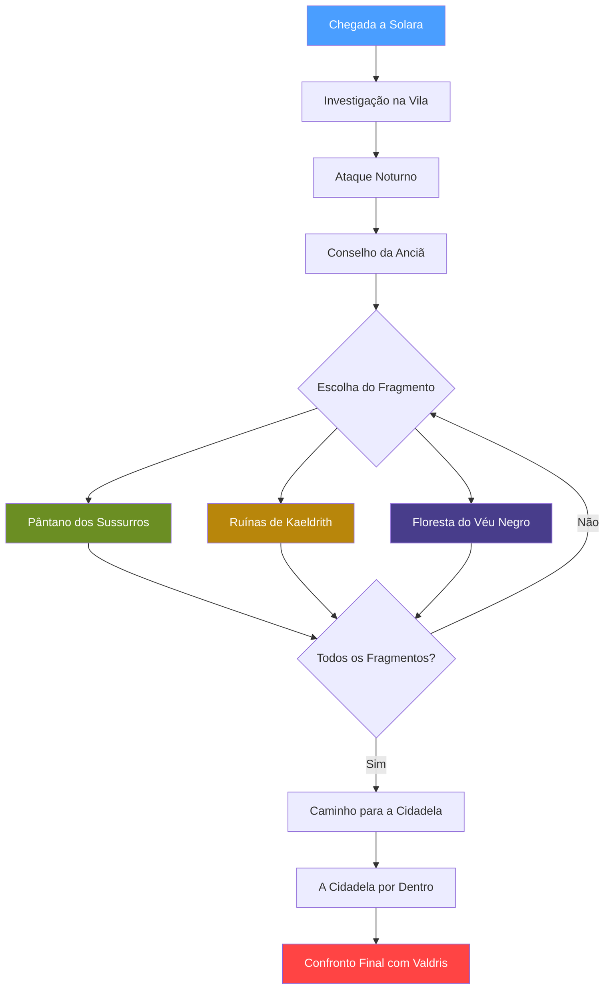

# ⚔️ A Coroa do Eclipse — Índice da Campanha

> **Sistema:** D&D 5ª Edição | **Jogadores:** 4 | **Nível:** 6 | **Duração:** ~8 horas
> **Tema:** Horror gótico, corrida contra o tempo, exploração

---

## 📜 Navegação da Campanha

### Visão Geral
- [[01 - Visão Geral]]

### Ato 1 — Sombras sobre Solara (~2h)
- [[Cena 1.1 - Chegada a Solara]]
- [[Cena 1.2 - Investigação na Vila]]
- [[Cena 1.3 - O Ataque Noturno]]
- [[Cena 1.4 - O Conselho da Anciã]]

### Ato 2 — Os Fragmentos Perdidos (~4h)
> *Os jogadores podem seguir estas cenas em qualquer ordem.*
- [[Cena 2.1 - O Pântano dos Sussurros]]
- [[Cena 2.2 - As Ruínas de Kaeldrith]]
- [[Cena 2.3 - A Floresta do Véu Negro]]

### Ato 3 — A Cidadela do Eclipse (~2h)
- [[Cena 3.1 - Caminho para a Cidadela]]
- [[Cena 3.2 - A Cidadela por Dentro]]
- [[Cena 3.3 - Confronto Final]]

---

## 🗺️ Quests Paralelas
- [[Quest - O Mercador Perdido]]
- [[Quest - A Maldição de Thorn]]
- [[Quest - O Espírito da Torre]]

## 🎲 Encontros Aleatórios
- [[Tabela de Encontros - Estrada]]
- [[Tabela de Encontros - Pântano]]
- [[Tabela de Encontros - Floresta]]

---

## 👤 PdMs (Personagens do Mestre)
- [[Valdris Mortebane]] — O necromante antagonista
- [[Anciã Miriel]] — Guardiã do conhecimento de Solara
- [[Capitão Borrin]] — Líder da guarda de Solara
- [[Sylas o Informante]] — Ladrão e comerciante de informações
- [[Morvena a Bruxa da Noite]] — Night Hag do Pântano
- [[Lorde Thorn]] — Vampire Spawn da Floresta do Véu Negro

## 👹 Monstros
- [[Monstro - Skeleton]] | [[Monstro - Zombie]] | [[Monstro - Ghast]]
- [[Monstro - Ghost]] | [[Monstro - Specter]] | [[Monstro - Wight]]
- [[Monstro - Wraith]] | [[Monstro - Mummy]]
- [[Monstro - Vampire Spawn]] | [[Monstro - Night Hag]]
- [[Monstro - Basilisk]] | [[Monstro - Owlbear]]
- [[Monstro - Troll]] | [[Monstro - Young Black Dragon]]
- [[Monstro - Ogre Zombie]] | [[Monstro - Minotaur Skeleton]]

## 💎 Itens Mágicos
- [[Item - Flame Tongue]] | [[Item - Cloak of Protection]]
- [[Item - Bag of Holding]] | [[Item - Boots of Speed]]
- [[Item - Ring of Protection]] | [[Item - Wand of Fireballs]]

---

## 🔗 Fluxo da Campanha

---

#campanha #dnd5e #nivel6 #horror #necromancia
