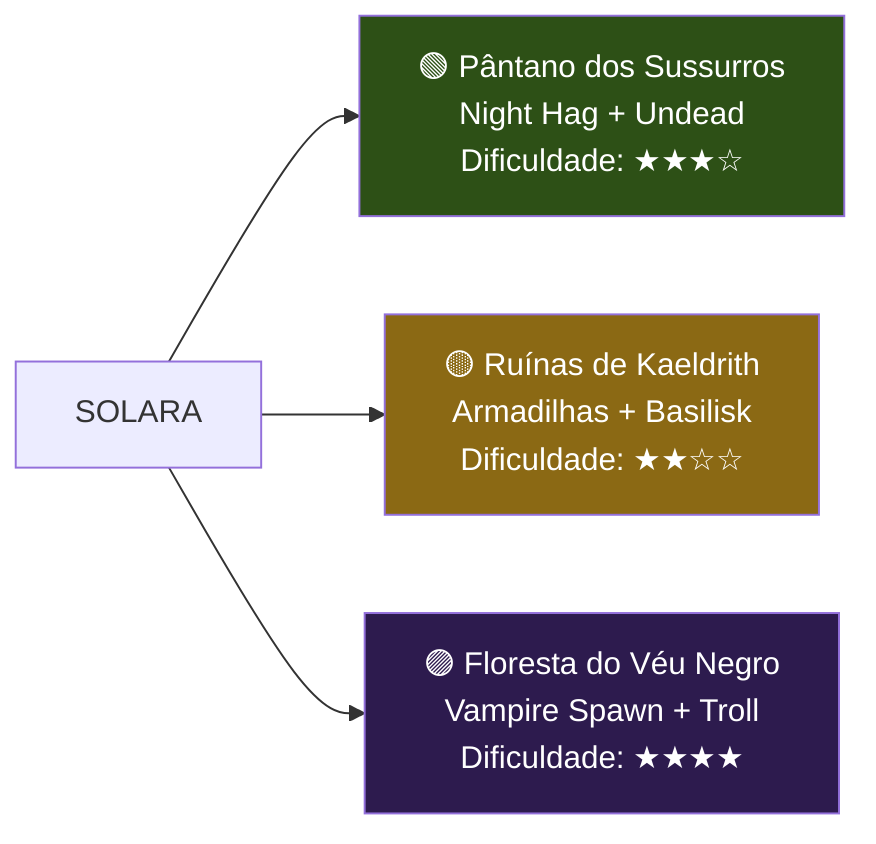

# 🌅 Cena 1.4 — O Conselho da Anciã

> **Duração estimada:** 15 min | **Foco:** Exposição narrativa, escolha do grupo
> **Trilha:** Música etérea / tema de sabedoria

---

## Leitura Dramática

> *A [[Anciã Miriel]] espera os heróis no Templo da Aurora, sentada diante de um mural desbotado que retrata guerreiros dourados lutando contra uma horda de sombras. A luz das velas faz as figuras parecerem se mover.*
>
> *"Sentem-se," ela diz, com a voz firme apesar dos olhos úmidos. "O que atacou Solara esta noite é apenas o começo. Aquele wight não agia por vontade própria — ele servia a alguém muito mais perigoso."*

---

## A Revelação de Miriel

A anciã compartilha o seguinte (com ou sem checks — ela quer que eles saibam):

1. **A Coroa do Eclipse** é real. Ela viu os registros nos arquivos do templo durante toda a sua vida.
2. **Valdris Mortebane** é um nome que ela conhece — ele foi expulso da Academia Arcana de Valdorin há 30 anos por experimentar com magia necromântica proibida.
3. Os **três fragmentos** da Coroa foram escondidos em:
   - O **[[Cena 2.1 - O Pântano dos Sussurros|Pântano dos Sussurros]]** — 1 dia a leste
   - As **[[Cena 2.2 - As Ruínas de Kaeldrith|Ruínas de Kaeldrith]]** — 1 dia ao norte
   - A **[[Cena 2.3 - A Floresta do Véu Negro|Floresta do Véu Negro]]** — 1 dia a oeste
4. O **eclipse lunar** acontece em 5 dias. Se Valdris reunir os três fragmentos antes disso, o ritual será realizado e a Coroa renascerá.
5. Ela possui um artefato — uma **Bússola Solar** — que aponta para os fragmentos. Ela a entrega ao grupo.

---

## Item: Bússola Solar

> **Bússola Solar** *(Wondrous Item, raro)*
> Uma bússola de ouro e cristal solar. A agulha aponta na direção do fragmento da Coroa do Eclipse mais próximo. Quando um fragmento está a menos de 100 pés, a bússola brilha intensamente.
> Além disso, 1×/dia o portador pode ativar a bússola para lançar *Daylight* centrado nela (sem concentração, dura 1 minuto).

---

## A Escolha

Miriel apresenta o mapa dos três locais. O grupo deve decidir a **ordem** em que buscará os fragmentos.

### Recomendações para o Mestre

| Ordem | Consequência Narrativa |
|-------|------------------------|
| Pântano primeiro | [[Morvena a Bruxa da Noite]] pode ser convencida a dar informações sobre os outros locais |
| Ruínas primeiro | Mais fácil; os jogadores ganham confiança e o [[Item - Flame Tongue]] |
| Floresta primeiro | Mais difícil; mas o [[Item - Cloak of Protection]] ajuda nos próximos |

---

## Presentes de Miriel

Antes de partirem, Miriel dá ao grupo:
- 2× **Poção de Cura Maior** (4d4+4 HP cada)
- 1× **Scroll de Lesser Restoration**
- A **Bússola Solar**
- Bênção: cada jogador ganha **+1d4 em um saving throw** (uso único), invocável como reação

---

## Transição para o Ato 2

O grupo parte de Solara. Dependendo da direção escolhida, o mestre abre a cena correspondente:

- **Leste →** [[Cena 2.1 - O Pântano dos Sussurros]]
- **Norte →** [[Cena 2.2 - As Ruínas de Kaeldrith]]
- **Oeste →** [[Cena 2.3 - A Floresta do Véu Negro]]

Durante a viagem, consulte as tabelas de [[Tabela de Encontros - Estrada]] para encontros aleatórios.

---

**Anterior:** [[Cena 1.3 - O Ataque Noturno]]
← [[00 - Índice da Campanha]]

#ato1 #exposição #escolha #bussola-solar
