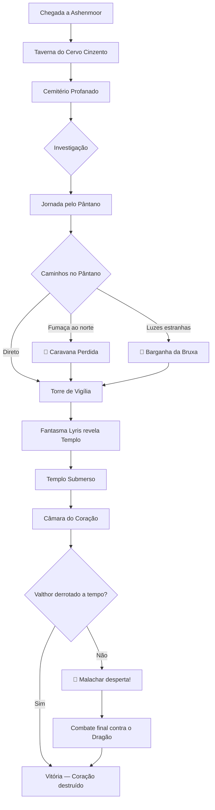

# ⚔️ O Crepúsculo de Ashenmoor
## Índice da Campanha

> **Sistema:** D&D 5ª Edição | **Jogadores:** 4 | **Nível:** 6 | **Duração:** ~8 horas
> **Tom:** Dark fantasy, investigação, sobrevivência em pântano

---

## 📖 Documentos Gerais
- [[01 - Visão Geral]] — Sinopse, temas, ganchos e linha do tempo

---

## 🎭 Ato I — O Chamado (~2h)
> *Os heróis chegam à cidade de Ashenmoor e investigam a origem de uma praga necrótica.*

1. [[Cena 1 - Chegada a Ashenmoor]] — Introdução, ambientação, encontro com o Conselho
2. [[Cena 2 - A Taverna do Cervo Cinzento]] — Roleplay, coleta de informações, PdMs
3. [[Cena 3 - O Cemitério Profanado]] — Primeiro combate (Ghouls + Ghast)

**Transição →** Pistas levam o grupo à Palude Negra

---

## 🌿 Ato II — A Palude Negra (~3h)
> *Os aventureiros atravessam o pântano corrompido enfrentando perigos naturais e sobrenaturais.*

4. [[Cena 4 - A Jornada pelo Pântano]] — Navegação, encontros aleatórios, atmosfera
5. [[Cena 5 - A Caravana Perdida]] — 🔀 *Side Quest* — Bandidos e uma Shambling Mound
6. [[Cena 6 - A Barganha da Bruxa]] — 🔀 *Side Quest* — Thessara, a Green Hag
7. [[Cena 7 - As Ruínas da Torre de Vigília]] — Capitão Roderic (Wight) + fantasma guardiã

**Transição →** Lyris revela a localização do Templo Submerso

---

## 🔥 Ato III — O Nexus Corrompido (~3h)
> *O confronto final nas profundezas do templo onde o ritual de ressurreição está em andamento.*

8. [[Cena 8 - O Templo Submerso]] — Exploração, armadilhas, Wraith guardião
9. [[Cena 9 - A Câmara do Coração]] — Confronto com Valthor + cultistas
10. [[Cena 10 - O Despertar do Dragão]] — 🐉 Boss final: Malachar (Young Black Dragon)

---

## 👤 Personagens do Mestre (PdMs)
| PdM | Papel | Localização |
|-----|-------|------------|
| [[Elara Thornwick]] | Prefeita de Ashenmoor | Prefeitura / Taverna |
| [[Mestre Brynn]] | Alquimista e curandeiro | Botica em Ashenmoor |
| [[Valthor o Corrompido]] | 💀 Vilão principal (Druida caído) | Templo Submerso |
| [[Thessara a Bruxa Verde]] | Green Hag ambígua | Pântano profundo |
| [[Capitão Roderic]] | Wight — antigo capitão da guarda | Torre de Vigília |
| [[Lyris - Fantasma Guardiã]] | Ghost — aliada espiritual | Torre de Vigília |

---

## 👹 Bestiário
| Monstro | CR | Aparece em |
|---------|---:|-----------|
| [[Ghoul]] | 1 | Cemitério, Pântano |
| [[Ghast]] | 2 | Cemitério |
| [[Will-o-Wisp]] | 2 | Pântano (aleatório) |
| [[Giant Constrictor Snake]] | 2 | Pântano (aleatório) |
| [[Ogre Zombie]] | 2 | Torre, Templo |
| [[Green Hag]] | 3 | Side Quest Bruxa |
| [[Wight]] | 3 | Torre de Vigília |
| [[Ghost]] | 4 | Torre de Vigília |
| [[Shambling Mound]] | 5 | Side Quest Caravana |
| [[Troll]] | 5 | Pântano (aleatório) |
| [[Wraith]] | 5 | Templo Submerso |
| [[Mage]] | 6 | Templo (Valthor) |
| [[Young Black Dragon]] | 7 | Boss Final |

---

## 🎲 Encontros Aleatórios
- [[Tabela de Encontros - Estrada]]
- [[Tabela de Encontros - Pântano]]
- [[Tabela de Encontros - Ruínas]]

---

## 💎 Itens e Recompensas
- [[Coração de Ébano]] — Artefato maldito central da trama
- [[Lâmina da Aurora]] — Recompensa para os heróis

---

## 🗺️ Diagrama de Fluxo da Campanha

---

> [!tip] Dica para o Mestre
> Esta campanha tem uma estrutura semi-linear com ramificações no Ato II. As side quests são opcionais mas fornecem informações e aliados valiosos para o Ato III. Se os jogadores se desviarem do caminho previsto, improvise usando as [[Tabela de Encontros - Pântano|tabelas de encontro aleatório]] e os PdMs disponíveis.